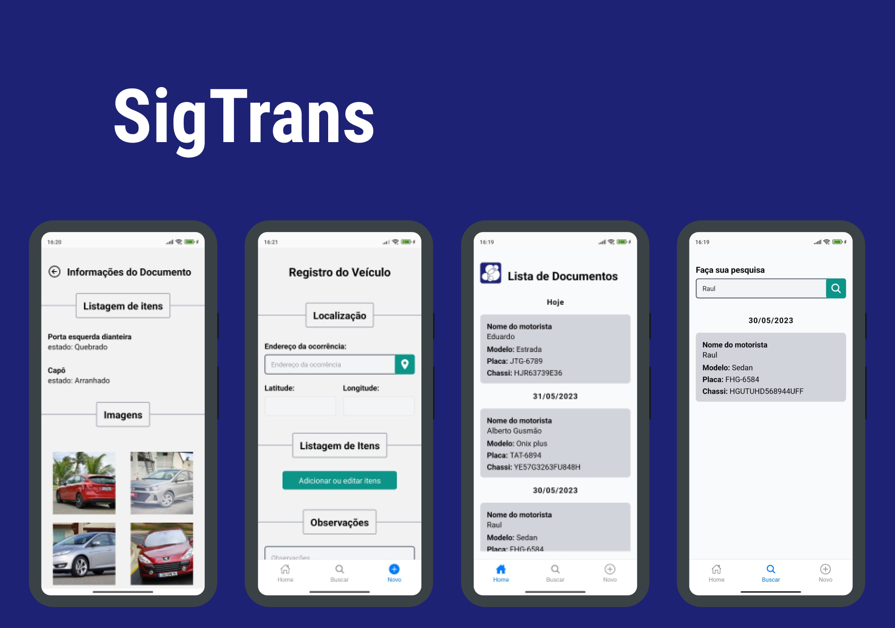

<h1 align="center">
  Sigtrans Application
</h1>
<br>

[](https://github.com/HelvioFilho/sigtrans-mobile/releases/tag/1.0)
<br><br>

<p align="center">
  <a href="#features">Features</a>&nbsp;&nbsp;&nbsp;|&nbsp;&nbsp;&nbsp;
  <a href="#technologies">Technologies</a>&nbsp;&nbsp;&nbsp;|&nbsp;&nbsp;&nbsp;
  <a href="#getting-started">Getting started</a>&nbsp;&nbsp;&nbsp;|&nbsp;&nbsp;&nbsp;
  <a href="#settings">Settings</a>&nbsp;&nbsp;&nbsp;|&nbsp;&nbsp;&nbsp;
  <a href="#project">Project</a>&nbsp;&nbsp;&nbsp;|&nbsp;&nbsp;&nbsp;
  <a href="#application">Application</a>
</p>

<br>

<p align="center">
  
</p>

---

## Features

- [x] Vehicle inspection record
- [x] GPS geolocation
- [x] Add and remove images in the document
- [x] Document search
- [x] Preview the document and generate PDF file
- [x] Created auxiliary support tables
- [x] Offline functional application \*

\*The first use of the application after installation need internet connection to generate an anonymous user who would manage the synchronization with the database.

## Technologies

This project was developed using the following technologies:

- [React Native](https://reactnative.dev/)
- [Expo bare workflow](https://expo.io/)
- [TypeScript](https://www.typescriptlang.org/)
- [Realm DB](https://realm.io/)

## Getting started

Clone the project and access the folder

```bash
$ git clone https://github.com/HelvioFilho/sigtrans-mobile && cd sigtrans-mobile
```

Follow the steps below

```bash
# Install the dependencies
$ npm install
```

```
# Start the project

# Android
$ expo run:android

# IOS
$ expo run:ios
```

## Settings

The application id can be obtained by creating an account at [Realm MongoDb](https://realm.mongodb.com), creating a Project, then a new application.

This is where the data was stored in the cloud for synchronization.

It is necessary to create an .env file in the root of the project and add the fields:

```
.Env file

#MongoDB Atlas id

APP_ID

# Image API

URL
```

it is also necessary to build an external API to store the images.

The current API used in the application works as follows:
it is also necessary to build an external API to store the images.

The current API used in the application works as follows:

```javascript
  const fileExtension = uri.split(".").pop();
  const photoFile = {
    name: `${uuid.v4()}.${fileExtension}`.toLocaleLowerCase(),
    uri: uri,
    type: `image/${fileExtension}`,
  } as any;

  const photoUploadForm = new FormData();
  photoUploadForm.append("file", photoFile);
  photoUploadForm.append("name", uuid.v4() as string);

  const updatedResponse = await api.post("sigtrans", photoUploadForm, {
    headers: {
      "Content-Type": "multipart/form-data",
    },
  });
```

The API call sends an image in file format and an id, created with uuid. Then she gets back a link with the url where the image was hosted.

## Project

This project was made for the company SigTrans, with the objective of facilitating the registration of the vehicle in the act of removal to the retention park.

## Application

[demo video](https://www.youtube.com/watch?v=v9XYuGoO3lw)
